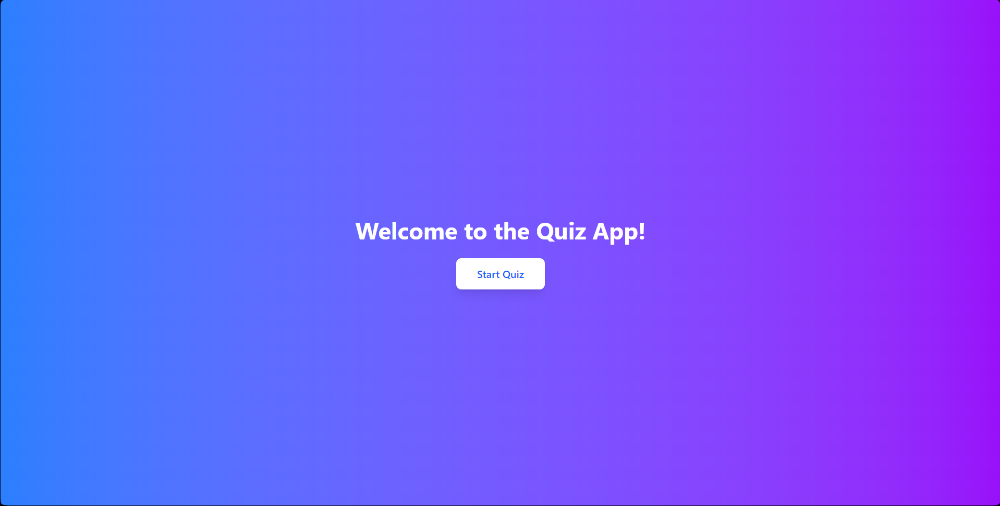

# Quiz Application

A web-based quiz application with gamification features, built using **React**, **TailwindCSS**, and **axios**. The app fetches quiz data from an external API and provides an intuitive and engaging user interface.

## Screen Shots:
1. [Home Page](screenShots/home.png)
2. [Quiz Page](screenShots/quiz.png)
2. [Wrong Answer](screenShots/answering.png)
2. [Correct Answer](screenShots/correctAnswer.png)
2. [Result](screenShots/Result.png)

## Demo

Watch a quick demo of the app:

[](https://drive.google.com/file/d/1W6wZ_JIBz6Ti9tmmBFWAtQGwp-2Er60Z/view?usp=sharing)
---

## Features
- **Start Quiz**: Begin the quiz with a single click.
- **Multiple-Choice Questions**: Answer questions with multiple-choice options.
- **Results Summary**: View your score and a summary of correct/incorrect answers after completing the quiz.
- **Gamification**: Earn points for correct answers and track your progress with a progress bar.
- **Responsive Design**: Works seamlessly on both desktop and mobile devices.


---

## Technologies Used
- **Frontend**: React
- **Styling**: TailwindCSS
- **API Integration**: Axios
- **State Management**: React Context API

---

## Setup Instructions

### Steps to Run the Project
1. **Clone the Repository**:
   ```bash
   git clone https://github.com/Irshad-Ahmaed/Testline_Web_Dev_Assignment.git
   cd Testline_Web_Dev_Assignment
   npm install
   npm run dev

## Gamification Features
- Points System: Earn points for each correct answer.
- Progress Bar: Track your progress through the quiz.
- Results Summary: View your total score and a breakdown of correct/incorrect answers.